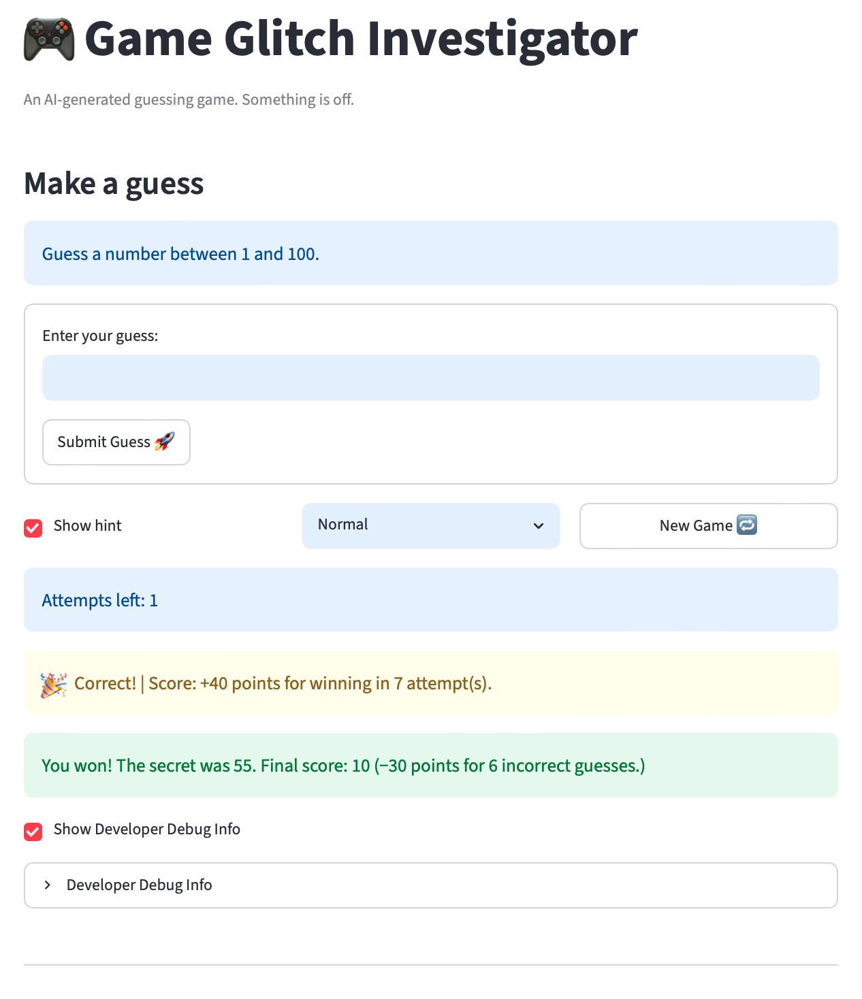

# 🎮 Game Glitch Investigator: The Impossible Guesser

## 🚨 The Situation

I asked an AI to build a simple "Number Guessing Game" using Streamlit.
It wrote the code, ran away, and now the game is unplayable. 

- Players can't win.
- The hints lie.
- The secret number seems to have commitment issues.

## 🛠️ Setup

1. Install dependencies: `pip install -r requirements.txt`
2. Run the broken app: `python -m streamlit run app.py` 

## 🕵️‍♂️ My Mission

1. **Play the game.** Open the "Developer Debug Info" tab in the app to see the secret number. Try to win.
2. **Find the State Bug.** Why does the secret number change every time you click "Submit"? Ask ChatGPT: *"How do I keep a variable from resetting in Streamlit when I click a button?"*
3. **Fix the Logic.** The hints ("Higher/Lower") are wrong. Fix them.
4. **Refactor & Test.** - Move the logic into `logic_utils.py`.
   - Run `pytest` in your terminal.
   - Keep fixing until all tests pass!

## 📝 My Experience

- [ ] Describe the game's purpose.
   - This game is a simple number guessing game. Players can choose from three different difficulty levels. Each level adjusts both the number of guesses and the range of numbers in the selection pool. Historical guesses are tracked to prevent duplicate guesses. Attempts remaining are tracked. Hints are provided based on the comparison of the guess and the secret number. A player wins the game if the guess the secret number. A player loses the game if the run out of attempts before guessing the secret number.
- [ ] Detail which bugs you found.
   - A number of bugs were found. Bug fixes are presented in a table below in the Summary of Changes section.
- [ ] Explain what fixes you applied.
   - Fixes are also presented in the table below in the Summary of Changes section.

## 📸 Demo Walkthrough

Describe your fixed game in numbered steps so a reader can follow along without watching a video:

1. Launch the app with `python -m streamlit run app.py`. The game opens with **Normal** difficulty selected (range 1–100, 8 attempts). Use the difficulty dropdown next to the buttons to switch to **Easy** (1–20, 6 attempts) or **Hard** (1–50, 5 attempts) at any time — changing difficulty automatically resets the game.
2. The blue info bar at the top shows the instructions and the current number of **Attempts Left**. Type a whole number into the **Enter your guess** field and press **Enter** or click **Submit Guess**. Entering a letter, decimal, duplicate, or out-of-range number displays an error and does not consume an attempt.
3. After each guess a hint appears — **📉 Go HIGHER!** or **📈 Go LOWER!** — followed by the score change for that turn (e.g. *Score: −5 points*). The Attempts Left counter decrements by one with each valid guess.
4. Keep narrowing your guess using the hints. When you guess correctly, **🎉 Correct!** appears alongside your win bonus. The final success message shows your score, the total deduction for incorrect guesses, and how many attempts you used (e.g. *You won! The secret was 42. Final score: 65 (−15 points for 3 incorrect guesses.)*).
5. If you run out of attempts the game ends with a loss message showing the secret number and your final score (minimum 10). Click **New Game** at any time to reset all state — score, history, attempts, and the guess field — and start a fresh round.

**App Screenshot** 


## 🧪 Test Results

```
============================= test session starts ==============================
platform darwin -- Python 3.12.0, pytest-9.0.3, pluggy-1.6.0 -- /Users/bagheera/repos/codepath/Codepath_AI_110/Week02/.venv/bin/python
cachedir: .pytest_cache
rootdir: /Users/bagheera/repos/codepath/Codepath_AI_110/Week02
plugins: anyio-4.13.0
collecting ... collected 73 items

tests/test_game_logic.py::TestGetRangeForDifficulty::test_easy_range PASSED [  1%]
tests/test_game_logic.py::TestGetRangeForDifficulty::test_normal_range PASSED [  2%]
tests/test_game_logic.py::TestGetRangeForDifficulty::test_hard_range PASSED [  4%]
tests/test_game_logic.py::TestGetRangeForDifficulty::test_unknown_difficulty_returns_default PASSED [  5%]
tests/test_game_logic.py::TestGetRangeForDifficulty::test_empty_string_returns_default PASSED [  6%]
tests/test_game_logic.py::TestParseGuess::test_valid_integer PASSED      [  8%]
tests/test_game_logic.py::TestParseGuess::test_valid_integer_boundary_low PASSED [  9%]
tests/test_game_logic.py::TestParseGuess::test_valid_integer_boundary_high PASSED [ 10%]
tests/test_game_logic.py::TestParseGuess::test_none_input PASSED         [ 12%]
tests/test_game_logic.py::TestParseGuess::test_empty_string PASSED       [ 13%]
tests/test_game_logic.py::TestParseGuess::test_letter_input PASSED       [ 15%]
tests/test_game_logic.py::TestParseGuess::test_word_input PASSED         [ 16%]
tests/test_game_logic.py::TestParseGuess::test_decimal_input PASSED      [ 17%]
tests/test_game_logic.py::TestParseGuess::test_decimal_with_zero_fraction PASSED [ 19%]
tests/test_game_logic.py::TestParseGuess::test_negative_integer PASSED   [ 20%]
tests/test_game_logic.py::TestParseGuess::test_zero PASSED               [ 21%]
tests/test_game_logic.py::TestParseGuess::test_whitespace_only PASSED    [ 23%]
tests/test_game_logic.py::TestParseGuess::test_leading_trailing_spaces_parse_successfully PASSED [ 24%]
tests/test_game_logic.py::TestParseGuess::test_very_large_integer PASSED [ 26%]
tests/test_game_logic.py::TestParseGuess::test_negative_decimal PASSED   [ 27%]
tests/test_game_logic.py::TestParseGuess::test_multiple_decimal_points PASSED [ 28%]
tests/test_game_logic.py::TestParseGuess::test_scientific_notation PASSED [ 30%]
tests/test_game_logic.py::TestCheckGuess::test_correct_guess_returns_win PASSED [ 31%]
tests/test_game_logic.py::TestCheckGuess::test_correct_guess_message PASSED [ 32%]
tests/test_game_logic.py::TestCheckGuess::test_guess_too_high_outcome PASSED [ 34%]
tests/test_game_logic.py::TestCheckGuess::test_guess_too_high_message_says_lower PASSED [ 35%]
tests/test_game_logic.py::TestCheckGuess::test_guess_too_low_outcome PASSED [ 36%]
tests/test_game_logic.py::TestCheckGuess::test_guess_too_low_message_says_higher PASSED [ 38%]
tests/test_game_logic.py::TestCheckGuess::test_boundary_one_below_secret PASSED [ 39%]
tests/test_game_logic.py::TestCheckGuess::test_boundary_one_above_secret PASSED [ 41%]
tests/test_game_logic.py::TestCheckGuess::test_returns_tuple_of_two PASSED [ 42%]
tests/test_game_logic.py::TestCheckGuess::test_both_zero_is_win PASSED   [ 43%]
tests/test_game_logic.py::TestCheckGuess::test_very_large_values_too_low PASSED [ 45%]
tests/test_game_logic.py::TestCheckGuess::test_negative_secret_win PASSED [ 46%]
tests/test_game_logic.py::TestCheckGuess::test_negative_secret_too_high PASSED [ 47%]
tests/test_game_logic.py::TestCheckGuess::test_negative_secret_too_low PASSED [ 49%]
tests/test_game_logic.py::TestUpdateScore::test_win_on_first_attempt_scores_100 PASSED [ 50%]
tests/test_game_logic.py::TestUpdateScore::test_win_on_second_attempt_scores_90 PASSED [ 52%]
tests/test_game_logic.py::TestUpdateScore::test_win_on_tenth_attempt_hits_floor PASSED [ 53%]
tests/test_game_logic.py::TestUpdateScore::test_win_beyond_tenth_attempt_still_floors_at_10 PASSED [ 54%]
tests/test_game_logic.py::TestUpdateScore::test_win_adds_to_existing_score PASSED [ 56%]
tests/test_game_logic.py::TestUpdateScore::test_too_high_deducts_5 PASSED [ 57%]
tests/test_game_logic.py::TestUpdateScore::test_too_low_deducts_5 PASSED [ 58%]
tests/test_game_logic.py::TestUpdateScore::test_too_high_and_too_low_deduct_equally PASSED [ 60%]
tests/test_game_logic.py::TestUpdateScore::test_score_can_go_negative PASSED [ 61%]
tests/test_game_logic.py::TestUpdateScore::test_unknown_outcome_leaves_score_unchanged PASSED [ 63%]
tests/test_game_logic.py::TestUpdateScore::test_cumulative_deductions PASSED [ 64%]
tests/test_game_logic.py::TestUpdateScore::test_win_on_attempt_zero_clamped_to_attempt_one PASSED [ 65%]
tests/test_game_logic.py::TestUpdateScore::test_win_with_very_large_attempt_number PASSED [ 67%]
tests/test_game_logic.py::TestUpdateScore::test_win_floor_applied_to_total PASSED [ 68%]
tests/test_game_logic.py::TestUpdateScore::test_outcome_is_case_sensitive PASSED [ 69%]
tests/test_game_logic.py::TestIsValidRange::test_easy_low_boundary_valid PASSED [ 71%]
tests/test_game_logic.py::TestIsValidRange::test_easy_high_boundary_valid PASSED [ 72%]
tests/test_game_logic.py::TestIsValidRange::test_easy_mid_range_valid PASSED [ 73%]
tests/test_game_logic.py::TestIsValidRange::test_easy_zero_is_invalid PASSED [ 75%]
tests/test_game_logic.py::TestIsValidRange::test_easy_negative_is_invalid PASSED [ 76%]
tests/test_game_logic.py::TestIsValidRange::test_easy_above_high_is_invalid PASSED [ 78%]
tests/test_game_logic.py::TestIsValidRange::test_hard_high_boundary_valid PASSED [ 79%]
tests/test_game_logic.py::TestIsValidRange::test_hard_above_high_is_invalid PASSED [ 80%]
tests/test_game_logic.py::TestIsValidRange::test_normal_high_boundary_valid PASSED [ 82%]
tests/test_game_logic.py::TestIsValidRange::test_normal_above_high_is_invalid PASSED [ 83%]
tests/test_game_logic.py::TestIsValidRange::test_normal_zero_is_invalid PASSED [ 84%]
tests/test_game_logic.py::TestIsValidRange::test_very_large_integer_invalid PASSED [ 86%]
tests/test_game_logic.py::TestIsValidRange::test_very_large_negative_invalid PASSED [ 87%]
tests/test_game_logic.py::TestIsValidRange::test_single_value_range_valid PASSED [ 89%]
tests/test_game_logic.py::TestIsValidRange::test_single_value_range_below_invalid PASSED [ 90%]
tests/test_game_logic.py::TestIsValidRange::test_single_value_range_above_invalid PASSED [ 91%]
tests/test_game_logic.py::TestIsHighScore::test_higher_score_is_new_high PASSED [ 93%]
tests/test_game_logic.py::TestIsHighScore::test_equal_score_is_not_new_high PASSED [ 94%]
tests/test_game_logic.py::TestIsHighScore::test_lower_score_is_not_new_high PASSED [ 95%]
tests/test_game_logic.py::TestIsHighScore::test_first_game_any_positive_score_beats_zero PASSED [ 97%]
tests/test_game_logic.py::TestIsHighScore::test_zero_does_not_beat_zero PASSED [ 98%]
tests/test_game_logic.py::TestIsHighScore::test_score_beats_previous_high_by_one PASSED [100%]

============================== 73 passed in 0.03s ==============================
```

## 🚀 Stretch Features

- [ ] [If you choose to complete Challenge 4, describe the Enhanced UI changes here — a screenshot is optional]

## Summary of Changes

### Bug Fixes

| Bug | Root Cause | Fix |
|---|---|---|
| Attempts Left showed 7 instead of 8 | `st.session_state.attempts` initialized to `1` | Changed initialization to `0` |
| Attempts Left always one behind | `st.info` rendered before the increment in Streamlit's top-down rerun | Moved display to after the increment |
| New Game button had no effect after game over | Handler never reset `st.session_state.status` back to `"playing"` | Added `status = "playing"` to the reset block |
| Hints were wrong on even-numbered turns | Submit block cast `secret` to a string on even attempts, causing lexicographic comparisons | Removed type coercion; `check_guess` always receives two integers |
| "Go HIGHER" / "Go LOWER" directions reversed in edge case | `check_guess` except branch had the messages swapped | Corrected the message strings |
| Invalid guesses (letters, out-of-range) added to history | `history.append` called before validation checks | Removed append from all invalid-input branches |
| Developer Debug window closed on every Submit | `st.expander` has no built-in state persistence across reruns | Persisted open/closed state in `st.session_state.debug_open` via a checkbox |
| Show Hint reset after every guess | Checkbox was inside `st.form`, which clears on submit | Moved outside the form; backed by `st.session_state.show_hint` |
| Previous guess remained in input after New Game | Streamlit reuses widget state when the key is unchanged | Added `game_count` to session state and included it in the input key |

### Features Added

- **Duplicate guess detection** — guesses already in history are rejected without consuming an attempt
- **Decimal rejection** — decimal inputs return an error instead of being silently rounded down
- **Range validation** — out-of-range guesses rejected without consuming an attempt; logic extracted to `is_valid_range()` in `logic_utils.py`
- **Enter key submits** — input and Submit button wrapped in `st.form` so pressing Enter works as expected
- **In-game difficulty selector** — dropdown added alongside the buttons; changing difficulty starts a fresh game automatically
- **Symmetric scoring** — replaced inconsistent even/odd attempt bonus logic with a flat −5 penalty per wrong guess and a win bonus of `max(10, 100 − 10 × (attempts − 1))`
- **Per-guess score feedback** — score change appended to the hint message each turn (e.g. *📉 Go HIGHER! | Score: −5 points.*)
- **Detailed win/loss messages** — both now show final score, total deduction, and incorrect guess count
- **High score tracking** — session high score persisted across games; updated on both win and loss (minimum score of 10 applied before comparison); displayed as a metric above the guess input and in the sidebar
- **New High Score notification** — a `🏆 New High Score!` banner appears when a win beats the previous best

### Refactoring

- **`logic_utils.py`** — populated with all six pure game functions: `get_range_for_difficulty`, `parse_guess`, `check_guess`, `update_score`, `is_valid_range`, and `is_high_score`
- **`app.py`** — removed duplicate function definitions; now imports all logic from `logic_utils` using PEP 8 compliant multi-line parenthetical import style
- **Google-style docstrings** — all six functions in `logic_utils.py` documented with `Args` and `Returns` sections
- **PEP 8 compliance** — all lines in `logic_utils.py` and `app.py` conform to the 79-character limit; long f-strings split across lines; variable renamed from `guess_word` to `guess_label` to satisfy linter

### Test Suite

73 tests across 6 classes in `tests/test_game_logic.py`:

| Class | Tests | What it covers |
|---|---|---|
| `TestGetRangeForDifficulty` | 5 | All three difficulty levels and the unknown/default fallback |
| `TestParseGuess` | 17 | Valid integers, empty/None input, letters, decimals, negatives, whitespace-only, scientific notation, very large integers, and boundary values |
| `TestCheckGuess` | 14 | Win, Too High, Too Low, one-off boundaries, return type, zero secret, very large values, and negative secrets |
| `TestUpdateScore` | 15 | Win bonus at various attempt counts including the floor, attempt-zero clamping, floor applied to total (not just bonus), symmetric penalties, negative scores, cumulative deductions, and case-sensitive outcome matching |
| `TestIsValidRange` | 16 | Low and high boundaries, mid-range, zero, negative, one-above-high for all three difficulty ranges, very large integers, very large negatives, and single-value ranges |
| `TestIsHighScore` | 6 | Score strictly exceeds high score, equal score, lower score, first-game zero baseline, zero vs zero, and beat-by-one boundary |
